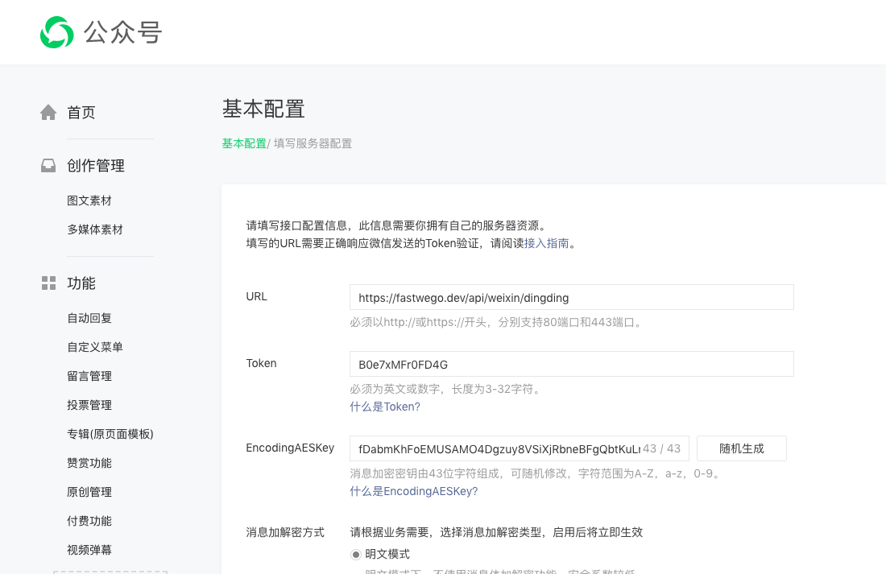
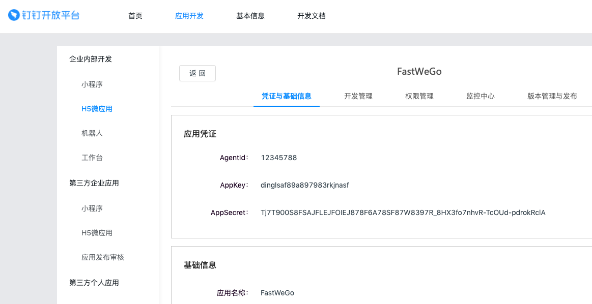
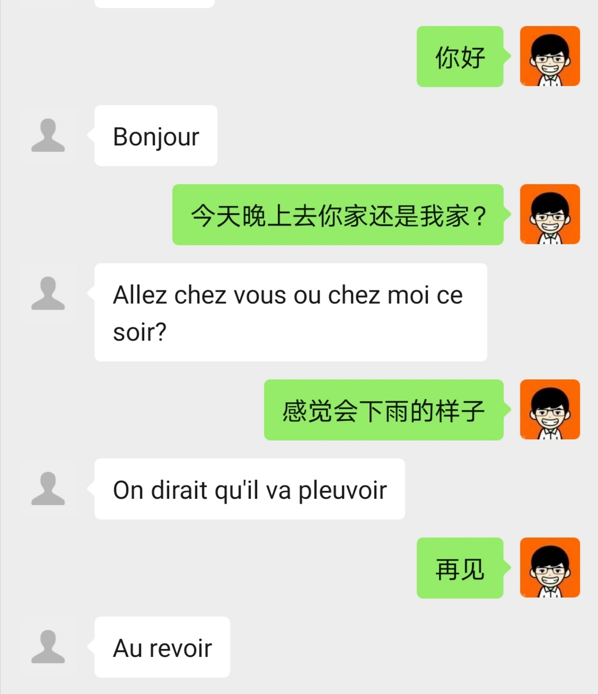

## 打通微信和钉钉服务是一种怎样的体验？

微信 和 钉钉，分属于 腾讯 和 阿里巴巴 两大阵营，当他们之间可以互联互通，会是一种怎样神奇的场景？

今天，我们就通过 `fastwego/offiaccount` 和 `fastwego/dingding` 这两个开源 Golang SDK 试一试：

实现一个微信公众号秒变翻译机的服务：将用户发送过来的中文文本，翻译成法语。

### 微信开放平台 & 钉钉开放平台

#### 微信公众号

开启开发模式，接管用户发送的消息：



同时，还将获取到微信公众号的 appid/secret/token 配置信息

#### 钉钉开放平台

开通企业内部 H5 微应用并完成 AI 接口授权：



同时还将获取的钉钉 AppKey/AppSecret 的配置信息

### 翻译服务开发

翻译服务非常简单：

- 获取微信公众号用户发送的文本
- 调用钉钉 AI 翻译接口，转换为目标语言
- 响应微信公众号，将翻译结果发送给用户

主要代码：

```go
// 微信公众账号
var OffiAccount *offiaccount.OffiAccount

// 钉钉 App 实例
var DingApp *dingding.App

func init() {
	// 加载配置文件
	viper.SetConfigFile(".env")
	_ = viper.ReadInConfig()

	// 创建公众号实例
	OffiAccount = offiaccount.New(offiaccount.Config{
		Appid:          viper.GetString("APPID"),
		Secret:         viper.GetString("SECRET"),
	})

	// 创建钉钉应用实例
	DingApp = dingding.NewApp(dingding.AppConfig{
		AppKey:    viper.GetString("AppKey"),
		AppSecret: viper.GetString("AppSecret"),
	})
}

func HandleMessage(c *gin.Context) {

	// 获取公众号消息
	body, _ := ioutil.ReadAll(c.Request.Body)
	log.Println(string(body))

	message, err := OffiAccount.Server.ParseXML(body)
	if err != nil {
		log.Println(err)
	}

	var output interface{}
	switch message.(type) {
	case type_message.MessageText: // 文本 消息
		msg := message.(type_message.MessageText)

		// 调用 钉钉 翻译服务
		params := struct {
			Query          string `json:"query"`
			TargetLanguage string `json:"target_language"`
			SourceLanguage string `json:"source_language"`
		}{}

		params.Query = msg.Content
		params.SourceLanguage = "zh"
		params.TargetLanguage = "fr"

		data, err := json.Marshal(params)
		if err != nil {
			fmt.Println(string(data), err)
			return
		}

		// 翻译接口
		resp, err := ai.Translate(DingApp, data)
		fmt.Println(string(resp), err)

		if err != nil {
			return
		}

		// 翻译结果
		result := struct {
			Errcode int64  `json:"errcode"`
			Errmsg  string `json:"errmsg"`
			Result  string `json:"result"`
		}{}
		err = json.Unmarshal(resp, &result)
		fmt.Println(result, err)
		if err != nil {
			return
		}

		// 回复公众号 翻译结果文本消息
		output = type_message.ReplyMessageText{
			ReplyMessage: type_message.ReplyMessage{
				ToUserName:   type_message.CDATA(msg.FromUserName),
				FromUserName: type_message.CDATA(msg.ToUserName),
				CreateTime:   strconv.FormatInt(time.Now().Unix(), 10),
				MsgType:      type_message.ReplyMsgTypeText,
			},
			Content: type_message.CDATA(result.Result),
		}
	}

	OffiAccount.Server.Response(c.Writer, c.Request, output)
}
```

### 运行效果



### 结语

至此，在`fastwego/offiaccount` 和 `fastwego/dingding` 这两个开源 Golang SDK 的辅助下，我们快速实现了微信 和 钉钉 服务打通的效果。

完整演示代码：[https://github.com/fastwego/offiaccount-demo](https://github.com/fastwego/offiaccount-demo)

你也试一试吧~
